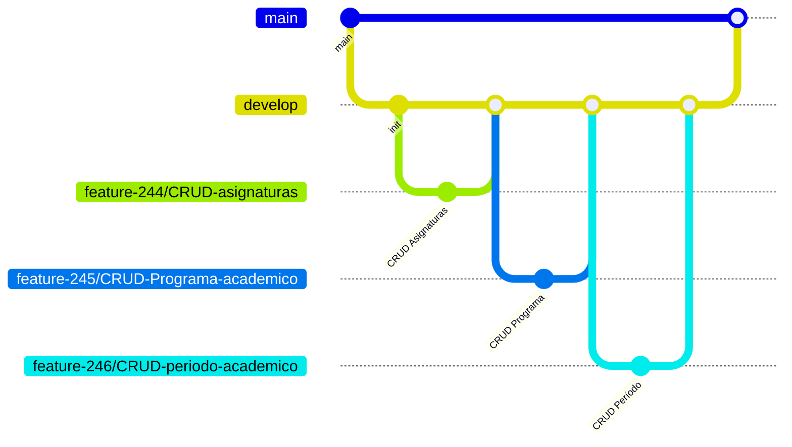

# AcaDigital  
**Sistema de Gestión Académica**  
**Entrega 1** — CRUD de tres entidades principales  


---

## Objetivo de la entrega
Construir la base del sistema implementando las operaciones **CRUD completas** para tres entidades principales relacionadas con la gestión académica:

- **Programa académico**: información general del programa, nivel educativo, duración y modalidad.  
- **Asignatura**: información sobre las materias impartidas, su carga horaria y tipo (teórica, práctica o mixta).  
- **Período académico**: información del ciclo (nombre, fechas de inicio y fin, estado actual).

---

## Instalacion
```bash
git clone https://github.com/tu-usuario/academia-pro.git
cd academia-pro
npm install
cp .env.example .env
npm run migrate
npm run dev
```
Servidor: http://localhost:3000  
Bruno: `Bruno/Peticiones/` (con carpetas para cada entidad: `Programa-Academico`, `Asignatura`, `Periodo-Academico`).

---

## Migraciones
```bash
npm run migrate
```
- `migrations/001-create-programas.sql`
- `migrations/002-create-asignaturas.sql`
- `migrations/003-create-periodos.sql`
**Índices y constraints** para unicidad y rendimiento.

---

## Endpoints (Fastify JSON Schema)
| Entidad        | Método | Ruta                  | Ejemplo de body |
|----------------|--------|-----------------------|-----------------|
| **Programa**   | POST   | `/programas`          | `{ "nombre": "Ing. Sistemas", "nivel": "profesional", "duracion": 10, "modalidad": "presencial" }` |
|                | GET    | `/programas`          | — |
|                | GET    | `/programas/:id`      | — |
|                | PUT    | `/programas/:id`      | `{ "nombre": "Ing. Actualizada" }` |
|                | DELETE | `/programas/:id`      | — |
| **Asignatura** | POST   | `/asignaturas`        | `{ "nombre": "Cálculo I", "codigo": "CAL-101", "cargaHoraria": 64, "tipo": "teórica", "programaId": "uuid" }` |
|                | GET    | `/asignaturas`        | — |
|                | GET    | `/asignaturas/:id`    | — |
|                | PUT    | `/asignaturas/:id`    | `{ "nombre": "Asignatura Actualizada" }` |
|                | DELETE | `/asignaturas/:id`    | — |
| **Período**    | POST   | `/periodos`           | `{ "nombre": "2025-I", "fechaInicio": "2025-01-15", "fechaFin": "2025-06-30" }` |
|                | GET    | `/periodos`           | — |
|                | GET    | `/periodos/:id`       | — |
|                | PUT    | `/periodos/:id`       | `{ "fechaFin": "2025-07-30" }` |
|                | DELETE | `/periodos/:id`       | — |

---

## Ejemplo de validaciones
- Campos **obligatorios**  
- `nombre` único y patrón `^[A-Z0-9-]+$`  
- Fechas ISO  
- `fechaFin > fechaInicio` (validado en controlador)  
- Respuestas estructuradas: `400`, `409`, `404`

**Ejemplo de error:**
```json
{
  "error": "fechaFin debe ser posterior a fechaInicio",
  "field": "fechaFin"
}
```

---

## Bruno Collection
```
Bruno/
└── Peticiones/
    ├── Programa-Academico/
    │   ├── CreateProgramaAcademico.bruno
    │   ├── DeleteProgramaAcademico.bruno
    │   ├── GetProgramaAcademico.bruno
    │   ├── GetProgramaAcademicoPorId.bruno
    │   ├── Programa-Academico.json
    │   ├── PutProgramaAcademico.bruno
    ├── Asignatura/
    │   ├── asignatura.bru
    │   ├── bruno.json
    │   ├── de_asignatura.bru
    │   ├── Listar Todos.bru
    │   ├── Obtener por ID.bru
    │   ├── up_asignatura.bru
    └── Periodo-Academico/
        ├── CreatePeriodoAcademico.bruno
        ├── DeletePeriodoAcademico.bruno
        ├── GetPeriodoAcademico.bruno
        ├── GetPeriodoPorId.bruno
        ├── Periodo-Academico.json
        ├── PostPeriodoAcademico.bruno
        ├── PutPeriodoAcademico.bruno

```
- 19 peticiones
- Incluye errores 400/409
- Carpetas por entidad para organización clara.

---
##  Acceso al Azure DevOps

Este proyecto está gestionado en Azure DevOps. Si eres colaborador externo y necesitas acceso para ver tareas, tableros, repositorios o pipelines, sigue estos pasos:

###  Solicitud de acceso

1. Envía un correo a **apolo4748@gmail.com** con el asunto: `Solicitud de acceso a Azure DevOps - AcademiaPro`.
2. Incluye en el mensaje:
   - Tu nombre completo
   - Correo asociado a tu cuenta Microsoft o GitHub
   - Rol que desempeñarás (ej. revisor, desarrollador, stakeholder)
3. Una vez aprobado, recibirás una invitación por correo para unirte al proyecto.

> El acceso está limitado a cuentas con correo válido y puede requerir una cuenta Microsoft gratuita.

---

### 📎 Enlace al proyecto (requiere acceso)

[https://dev.azure.com/Deilons/AcaDigital - inesxu]([https://dev.azure.com/Deilons/AcaDigital](https://dev.azure.com/Deilons/AcaDigital%20-%20Inesxu))

---

## Flujo de ramas

- 3 branches principales: `feature-244/CRUD-asignaturas`, `feature-245/CRUD-Programa-academico`, `feature-246/CRUD-periodo-academico`.  
- Todas van a `develop` y de `develop` a `main`.  

---

## Licencia
MIT © AcademiaPro 2025

--- 
